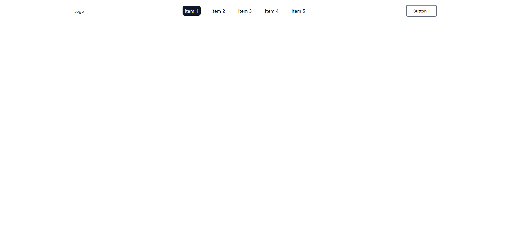
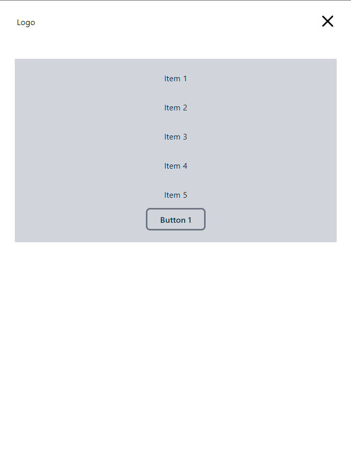

# Responsive Navbar with TailwindCSS

A fully responsive navbar created with tailwind css

###### Desktop View

##### Mobile View

    
    

---

To use the navbar

Copy the code from `index.html` and use it in your file.

All the classes used are tailwindcss classes so be sure to generate all the classes using tailwindcss.

[Docs from tailwind](https://tailwindcss.com/docs/installation)

---
